# League Lobster Text Reminders - Architecture Diagram

## System Architecture

```mermaid
graph TB
    %% External Systems
    EXT[External League Website<br/>Schedule Data] 
    GITHUB[GitHub Repository<br/>michael-lowe-nz/scrape-and-text-remind]
    
    %% GitHub Actions CI/CD
    subgraph "GitHub Actions CI/CD"
        GHA[GitHub Actions Workflow]
        OIDC[OIDC Provider<br/>token.actions.githubusercontent.com]
    end
    
    %% Multi-Account Strategy
    subgraph "AWS Multi-Account Setup"
        subgraph "Deploy Account (746512892315)"
            DEPLOY_ROLE[GitHub Action Role<br/>Cross-Account Deploy]
        end
        
        subgraph "Dev Environment (476203294330)"
            DEV_STACK[Dev Stage Stack]
        end
        
        subgraph "Test Environment (653221278763)"
            TEST_STACK[Test Stage Stack]
        end
        
        subgraph "Production Environment (365979456435)"
            PROD_STACK[Production Stage Stack]
        end
    end
    
    %% Detailed Production Architecture
    subgraph "Production Environment Detail"
        subgraph "EventBridge Scheduling"
            EB_RULE[EventBridge Rule<br/>Cron: 30 8 * * SUN<br/>8:30pm NZT Sunday]
        end
        
        subgraph "Lambda Functions (Per Team)"
            LAMBDA1[Alert Gen-X Function<br/>Node.js 22.x<br/>5s timeout<br/>X-Ray tracing]
            LAMBDA2[Alert Team2 Function<br/>Node.js 22.x<br/>5s timeout<br/>X-Ray tracing]
            LAMBDA_N[Alert TeamN Function<br/>...]
        end
        
        subgraph "SNS Topics (Per Team)"
            SNS_TEAM1[Gen-X Alerts Topic<br/>KMS Encrypted]
            SNS_ADMIN1[Gen-X Admin Alerts<br/>KMS Encrypted]
            SNS_TEAM2[Team2 Alerts Topic<br/>KMS Encrypted]
            SNS_ADMIN2[Team2 Admin Alerts<br/>KMS Encrypted]
        end
        
        subgraph "SMS Subscribers"
            SMS1[Team Member Phones<br/>+64 xxx xxx xxx]
            SMS2[Admin Phones<br/>+64 xxx xxx xxx]
        end
        
        subgraph "IAM & Security"
            KMS[AWS Managed KMS Key<br/>alias/aws/sns]
            IAM_ROLE[Lambda Execution Roles<br/>Least Privilege Access]
            LOGS[CloudWatch Logs<br/>/aws/lambda/AlertFunction]
        end
        
        subgraph "Testing Infrastructure"
            TEST_LAMBDA[Test Stack<br/>Custom Resource]
            TEST_INVOKE[Lambda Invoke Test<br/>Post-Deploy Validation]
        end
    end
    
    %% Data Flow
    GITHUB -->|Push to main| GHA
    GHA -->|Authenticate via| OIDC
    OIDC -->|Assume Role| DEPLOY_ROLE
    DEPLOY_ROLE -->|Deploy to| DEV_STACK
    DEPLOY_ROLE -->|Deploy to| TEST_STACK
    DEPLOY_ROLE -->|Deploy to| PROD_STACK
    
    %% Production Flow
    EB_RULE -->|Weekly Trigger| LAMBDA1
    EB_RULE -->|Weekly Trigger| LAMBDA2
    EB_RULE -->|Weekly Trigger| LAMBDA_N
    
    LAMBDA1 -->|HTTP GET| EXT
    EXT -->|HTML Response| LAMBDA1
    LAMBDA1 -->|Parse & Process| LAMBDA1
    
    LAMBDA1 -->|Publish Message| SNS_TEAM1
    LAMBDA1 -->|Publish Admin Alert| SNS_ADMIN1
    
    SNS_TEAM1 -->|SMS Delivery| SMS1
    SNS_ADMIN1 -->|SMS Delivery| SMS2
    
    %% Similar for other teams
    LAMBDA2 -->|HTTP GET| EXT
    LAMBDA2 -->|Publish Message| SNS_TEAM2
    LAMBDA2 -->|Publish Admin Alert| SNS_ADMIN2
    SNS_TEAM2 -->|SMS Delivery| SMS1
    SNS_ADMIN2 -->|SMS Delivery| SMS2
    
    %% Security & Monitoring
    KMS -->|Encrypt| SNS_TEAM1
    KMS -->|Encrypt| SNS_ADMIN1
    KMS -->|Encrypt| SNS_TEAM2
    KMS -->|Encrypt| SNS_ADMIN2
    
    IAM_ROLE -->|Permissions| LAMBDA1
    IAM_ROLE -->|Permissions| LAMBDA2
    
    LAMBDA1 -->|Logs| LOGS
    LAMBDA2 -->|Logs| LOGS
    
    %% Testing
    TEST_INVOKE -->|Invoke| LAMBDA1
    
    %% Styling
    classDef aws fill:#FF9900,stroke:#232F3E,stroke-width:2px,color:#fff
    classDef github fill:#24292e,stroke:#fff,stroke-width:2px,color:#fff
    classDef external fill:#e1f5fe,stroke:#0277bd,stroke-width:2px
    classDef security fill:#f3e5f5,stroke:#7b1fa2,stroke-width:2px
    
    class LAMBDA1,LAMBDA2,LAMBDA_N,SNS_TEAM1,SNS_ADMIN1,SNS_TEAM2,SNS_ADMIN2,EB_RULE,KMS,IAM_ROLE,LOGS,TEST_LAMBDA,TEST_INVOKE aws
    class GITHUB,GHA,OIDC,DEPLOY_ROLE github
    class EXT,SMS1,SMS2 external
    class KMS,IAM_ROLE security
```

## Component Details

### **Core Components**

| Component | Purpose | Configuration |
|-----------|---------|---------------|
| **EventBridge Rule** | Weekly scheduling | Cron: `30 8 * * SUN` (8:30pm NZT) |
| **Lambda Functions** | Game scraping & SMS logic | Node.js 22.x, 5s timeout, X-Ray tracing |
| **SNS Topics** | Message distribution | KMS encrypted, per-team topics |
| **SMS Subscriptions** | Player notifications | Phone numbers from contacts.yml |

### **Security Features**

- **KMS Encryption**: All SNS topics encrypted with AWS managed keys
- **IAM Least Privilege**: Custom roles with minimal required permissions
- **CDK-nag Compliance**: AWS Solutions Pack + HIPAA checks
- **OIDC Authentication**: Secure GitHub Actions deployment

### **Multi-Environment Strategy**

- **Dev**: Local development with test contacts
- **Test**: Staging environment with test data
- **Production**: Live system with real contacts and scheduling

### **Data Flow**

1. **Weekly Trigger**: EventBridge triggers Lambda functions every Sunday
2. **Web Scraping**: Lambda fetches HTML from external league website
3. **Data Processing**: Cheerio parses HTML to extract game information
4. **Message Generation**: Creates formatted SMS messages with game details
5. **SMS Delivery**: SNS publishes to subscribed phone numbers
6. **Admin Alerts**: Separate admin notifications for issues/no games

### **Monitoring & Observability**

- **CloudWatch Logs**: Centralized logging for all Lambda functions
- **X-Ray Tracing**: Distributed tracing for performance monitoring
- **CDK-nag Reports**: Security and compliance validation
- **Test Stack**: Post-deployment validation via custom resources
